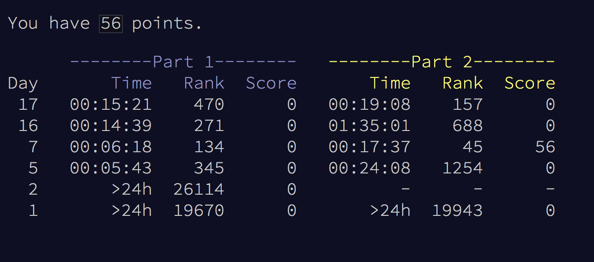

Advent of Code 2017 :)

I used this opportunity to finally learn myself a lisp.  I chose racket cause it seemed like a well-recommended learning language with a currently active community.  It's been challenging and fun!  I also realized after day 5 that there's a leaderboard that gives you points if you're one of the first 100 people to solve the challenges each night, so I have also started using python to solve challenges as soon as they come out with the aim of getting on the leaderboard.  (Python solutions are also helpful to verify the accuracy of my racket solutions)

